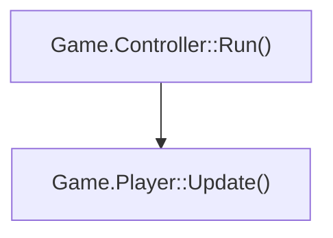

# CSIndexer 機能改修要求仕様書

## 1. 目的

CSIndexer に対して、次の機能を追加・改修する。

- ラムダ式を対象としたシンボル検索
- 関数属性の保存と表示
- 非同期関数へ到達する最短経路の表示
- メンバー初期化子内にあるラムダ式の一意な命名
- 呼び出し元方向の関数呼び出しツリー出力
- ワイルドカードおよび正規表現によるシンボル検索
- 関数ソースコードの正規化とデータベース保存
- 関数ソースコードの表示および文字列検索
- 関数名とソースコード条件を組み合わせた検索

本書は実装を前提とした要求仕様書であり、機能の採否を検討する提案書ではない。

## 2. 共通方針

- 後方互換性は保証しない。
- 必要に応じてデータベーススキーマを変更する。
- 既存データベースを新スキーマへ移行する機能は実装しなくてよい。
- 旧スキーマを検出した場合は、再インデックスが必要であることを明示して処理を中止する。
- シンボルの識別、型情報の取得、ソースコードの解析には Roslyn の構文情報およびシンボル情報を使用する。
- 表示名だけでシンボル間の関連を管理せず、データベース上のシンボルIDを使用する。
- グラフ探索では循環参照を前提とし、訪問済みシンボルIDを管理して無限ループを防止する。
- 深い呼び出しグラフでスタックオーバーフローを起こさないよう、反復処理による探索を優先する。
- 同じ入力とインデックスに対して、検索結果と出力順序が常に同じになるようにする。
- プロファイルが異なるデータを検索結果に混在させない。
- JSON出力では、表示用文字列だけでなく、各属性を可能な限り独立したフィールドとして出力する。
- 出力件数や探索件数を制限した場合は、黙って結果を欠落させず、打ち切り状態を明示する。

## 3. コマンド体系

追加・拡張する主要コマンドを次のように統一する。

| 用途 | コマンド |
|---|---|
| シンボル検索 | `csindex symbol find` |
| 非同期最短経路 | `csindex async tree` |
| 呼び出し元ツリー | `csindex callers tree` |
| 関数ソース表示 | `csindex source show` |
| 関数ソース検索 | `csindex source search` |

コマンド名にはアンダースコアを使用せず、既存の `symbol list` と同様に空白区切りのサブコマンド形式を使用する。

## 4. ラムダ式の検索

### 4.1 要件

`csindex symbol find` でラムダ式を検索できるようにする。

次の形式を受け付ける。

```text
csindex symbol find "::<lambda#1>"
csindex symbol find "Function()::<lambda#2>"
csindex symbol find "Game.Player::Update()::<lambda#1>"
csindex symbol find "Game.Player::Update()::<lambda#*>"
```

検索文字列の意味は次のとおりとする。

- `::<lambda#1>`
  - 所有関数を問わず、ラムダ番号が1のラムダを検索する。
- `Function()::<lambda#2>`
  - 所有関数名が `Function()` で、ラムダ番号が2のラムダを検索する。
- 完全修飾名
  - 名前空間、型、所有関数、ラムダ番号が一致するラムダを検索する。
- 複数件に一致した場合
  - エラーにはせず、該当するラムダをすべて列挙する。

既存の `--kind lambda` と併用できるようにする。

### 4.2 ラムダ番号

ラムダ番号は、ラムダを所有する関数または初期化子ごとの通し番号とする。

関数内にネストされたラムダも、所有関数内のソースコード上の出現順で番号を付ける。

```text
Game.Player::Update()::<lambda#1>
Game.Player::Update()::<lambda#2>
Game.Player::Do()::<lambda#1>
```

ラムダのネストごとに番号をリセットしない。

同じ所有者に複数のラムダが存在する場合、ラムダの構文開始位置を基準として安定した順番で採番する。

## 5. メンバー初期化子内のラムダ命名

### 5.1 問題

クラスメンバーの初期化子にラムダが存在する場合、関数を所有者とする命名規則だけでは名前が重複する。

```csharp
class A
{
    Action member1 = () => {};
    Action member2 = () => {};
}
```

### 5.2 命名規則

関数外の初期化子については、初期化対象のメンバーをラムダの所有者として扱う。

表示名は次の形式とする。

```text
A::<initializer:member1>::<lambda#1>
A::<initializer:member2>::<lambda#1>
```

対象には少なくとも次を含める。

- フィールド初期化子
- プロパティ初期化子
- イベント初期化子

同じ初期化子内に複数のラムダがある場合は、その初期化子内のソースコード上の出現順で番号を付ける。

```text
A::<initializer:member1>::<lambda#1>
A::<initializer:member1>::<lambda#2>
```

この命名に使用する所有者情報は表示名だけで生成せず、所有メンバーのシンボルIDまたは安定したシンボルキーとして保持する。

異なるファイルに分かれた `partial` 型でも、所有メンバーが異なるラムダは別のシンボルとして識別する。

## 6. 関数属性の保存と表示

### 6.1 保存する属性

関数シンボルについて、少なくとも次の情報を個別のフィールドとして保存する。

- アクセス修飾子
- `static` の有無
- 返り値の型
- 既存の非同期判定情報
- 関数種別
- 所有シンボル
- ソース定義の有無

関数種別には少なくとも次を含める。

- メソッド
- コンストラクター
- ローカル関数
- ラムダ
- アクセサー
- 演算子
- 変換演算子

アクセス修飾子は次の値を区別する。

- `public`
- `protected`
- `internal`
- `protected internal`
- `private protected`
- `private`
- 該当なし

返り値の型は、検索や同一性判定に使える正式な型情報と、表示に使う型名を分離して保持できる構造にする。

### 6.2 表示形式

テキスト出力では、アクセス修飾子、`static`、`async`、返り値、関数名、引数型をC#の宣言に近い順番で表示する。

```text
public static async System.Threading.Tasks.Task<System.Int32> Tokyo.Gamer::Play(System.String,System.Threading.CancellationToken)
```

名前空間省略オプションが指定された場合は、返り値型と引数型にも既存の短縮表示規則を適用する。

```text
public static async Task<Int32> Gamer::Play(String,CancellationToken)
```

コンストラクターなど返り値を持たないシンボルでは、返り値を表示しない。

ラムダやローカル関数などアクセス修飾子が存在しないシンボルでは、アクセス修飾子を表示しない。

JSON出力では、少なくとも次のフィールドを独立して出力する。

```json
{
  "displayName": "Tokyo.Gamer::Play(System.String)",
  "kind": "method",
  "accessibility": "public",
  "isStatic": true,
  "isAsync": true,
  "returnType": "System.Threading.Tasks.Task<System.Int32>"
}
```

## 7. 非同期関数への最短経路表示

### 7.1 コマンド

```text
csindex async tree <symbol>
```

例:

```text
csindex async tree "Klass::Function()"
csindex async tree "Klass::Function()" --output line
csindex async tree "Klass::Function()" --output json
csindex async tree "Klass::Function()" --max-nodes 500
```

`--output` には次を指定できるようにする。

| 値 | 内容 |
|---|---|
| `tree` | ツリー形式。既定値 |
| `line` | 1行の経路文字列 |
| `json` | 機械処理向けの構造化データ |

### 7.2 探索方向と出力

指定された関数から呼び出し先方向へ探索し、到達可能な非同期関数までの最短経路を表示する。

既定の出力はツリー形式とする。

```text
Klass::Function()
└─ Klass2::Function2()
   └─ async Klass3::AFunction3()
```

`--output line` が指定された場合は、同じ経路をヘッダーなどを含まない1行の文字列として出力する。

```text
Klass::Function() -> Klass2::Function2() -> async Klass3::AFunction3()
```

1行形式の区切り文字は ` -> ` に固定する。

指定された関数自体が非同期関数である場合は、その関数だけを表示する。

ツリー形式:

```text
async Klass::Function()
```

1行形式:

```text
async Klass::Function()
```

到達可能な非同期関数が存在しない場合は、その旨を明示する。経路が存在しないこと自体はコマンド実行エラーとしない。

### 7.3 非同期関数の判定

非同期関数の判定には、既存の非同期判定規則を使用する。

少なくとも次を対象とする。

- `async` 修飾子を持つ関数
- `Task`
- `Task<T>`
- `ValueTask`
- `ValueTask<T>`
- `UniTask`
- `UniTask<T>`
- 既存仕様で非同期型として登録されている型

関数名の `Async` 接尾辞だけでは非同期関数と判定しない。

非同期ラムダも非同期関数として扱う。

最短経路の探索および保存対象は、ソースコードを保持する関数またはラムダに限定する。
外部ライブラリなどのmetadata-only関数は、戻り値型による非同期判定の対象にはなり得るが、
保存する最短経路の終端または中間ノードには含めない。

### 7.4 同じ最短距離を持つ経路

最短距離が同じ非同期関数または経路が複数存在する場合は、そのうち1つの最短経路だけを表示する。

表示時に改めて経路を選択してはならない。インデックス作成時に最短距離を記録した際の探索順を利用し、その時点で選択された経路を保存する。

各関数について、少なくとも次の情報を保持する。

```text
async_involvement_depth
async_next_symbol_id
```

`async_next_symbol_id` は、選択された最短経路上で次に呼び出される関数のシンボルIDとする。

更新規則は次のとおりとする。

1. 現在の記録より短い経路を発見した場合は、距離と次シンボルIDを更新する。
2. 現在の記録と同じ距離の経路を後から発見した場合は、既に保存されている次シンボルIDを上書きしない。
3. 表示時は、保存された `async_next_symbol_id` を順番にたどる。
4. 表示時に同距離の候補を再検索したり、別の並び順で再選択したりしない。
5. 終端となる非同期関数では、距離を `0`、次シンボルIDを `null` とする。

最短距離を計算する際の候補処理順は決定的なものにし、データベースの未指定の取得順などに依存させない。同じ入力を再インデックスした場合は、同じ最短経路が選ばれるようにする。

選択された経路では距離が1ずつ減少するため、次シンボルIDをたどる際には次の条件を検証する。

```text
current.async_involvement_depth
    == next.async_involvement_depth + 1
```

不整合なデータや循環を考慮し、表示処理でも訪問済みシンボルIDを管理する。

### 7.5 出力制限

`--max-nodes` で最大出力ノード数を指定できるようにする。

- 既定値は `500`
- 起点もノード数に含める
- 上限へ達した場合は出力を打ち切る
- 打ち切りが発生したことをテキスト、1行、JSONの各形式で明示する

## 8. 呼び出し元方向の関数呼び出しツリー

### 8.1 コマンド

```text
csindex callers tree <symbol>
```

例:

```text
csindex callers tree "Game.Player::Play()" --depth 3
csindex callers tree "Game.Player::Play()" --depth 0 --max-nodes 1000
csindex callers tree "Game.Player::Play()" --output mermaid
```

### 8.2 探索方向

指定された関数を起点として、その関数を呼び出している関数を再帰的に探索する。

深さは次のように定義する。

- 深さ `0`: 起点
- 深さ `1`: 起点を直接呼び出す関数
- 深さ `2`: 深さ1の関数を直接呼び出す関数

`--depth 0` が明示された場合は、深さを制限せず、到達できる限り探索する。

`--depth` を省略した場合の既定値は `3` とする。

### 8.3 最大ノード数

`--max-nodes` で最大ノード数を指定できるようにする。

- 既定値は `500`
- 起点もノード数に含める
- 深さ制限なしの場合も最大ノード数を適用する
- 上限に達した場合は、探索と出力を打ち切る
- 打ち切りが発生したことを出力に明示する

探索順序は幅優先とし、同じ深さでは正式な表示名、ソース位置、シンボルIDの順に並べる。

### 8.4 循環参照

再帰呼び出しや相互呼び出しを考慮し、訪問済みシンボルIDを管理する。

同じ関数をノードとして重複生成しない。

循環する辺は削除せず、Mermaid上では既存ノードを参照する辺として表現する。

### 8.5 外部関数の除外

呼び出しツリーの探索対象は、インデックス対象プロジェクト内にソース定義を持つ関数に限定する。

次は探索対象から除外する。

- `System` 名前空間およびその配下
- 参照アセンブリにしか存在しない関数
- 外部ライブラリのメタデータシンボル
- ソースコードがインデックス対象外の関数

名前空間文字列だけで外部関数を判定せず、ソース定義の有無と所属アセンブリも使用する。

### 8.6 ラムダ内の呼び出し

ラムダ内に記述された関数呼び出しは、そのラムダからの呼び出しとして扱う。

```csharp
void Register()
{
    SetCallback(() => Play());
}
```

この例では、少なくとも次の呼び出し関係を記録する。

```text
Register() -> SetCallback(...)
Register()::<lambda#1> -> Play()
```

`Play()` を `Register()` からの直接呼び出しとしては扱わない。

ラムダの定義元である `Register()` とラムダの間には所有関係を記録してよいが、その所有関係を関数呼び出しとしては扱わない。

デリゲートの `Invoke()`、イベント発火、コールバック登録先などを解析して、ラムダが実際に実行される場所を推測する処理は実装しない。

### 8.7 Mermaid出力

`--output mermaid` が指定された場合は、Mermaidの `flowchart` 形式で出力する。



- ノードIDには表示名を直接使用せず、シンボルIDを基にした安全なIDを使用する。
- ノードラベル内の引用符、改行、角括弧などを適切にエスケープする。
- 辺の向きは、実際の呼び出し方向である「呼び出し元から呼び出し先」とする。
- 最大ノード数で打ち切った場合は、Mermaidコメントとして打ち切りを記録する。

## 9. `symbol find` の検索拡張

### 9.1 基本構文

```text
csindex symbol find <pattern>
```

パターンに `*` が含まれていない場合は完全一致として扱う。

パターンに `*` が含まれる場合はワイルドカード検索として扱う。

`*` は0文字以上の任意の文字列に一致する。他の文字はリテラルとして扱う。

### 9.2 ワイルドカード検索

名前空間を対象とした例:

```text
csindex symbol find "*.Gamer::Play"
```

クラス名を対象とした例:

```text
csindex symbol find "Tokyo.*::Play"
```

関数名を対象とした例:

```text
csindex symbol find "Tokyo.Gamer::P*l*y"
```

引数リストを省略した関数名は、すべてのオーバーロードに一致させる。

```text
Tokyo.Gamer::Play
```

引数リストを指定した場合は、そのシグネチャに一致する関数だけを返す。

```text
Tokyo.Gamer::Play(System.String)
```

### 9.3 要素別フィルター

完全修飾名に加えて、名前の構成要素を個別に指定できるようにする。

```text
csindex symbol find --namespace "Tokyo.*"
csindex symbol find --type "*Gamer"
csindex symbol find --method "P*l*y"
csindex symbol find --namespace "Tokyo.*" --type "*Gamer" --method "Play"
```

複数の条件が指定された場合は、すべての条件を満たすシンボルだけを返す。

### 9.4 正規表現検索

`--regex` が指定された場合は、検索文字列を正規表現として扱う。

```text
csindex symbol find \
  --regex \
  "^(Tokyo|Fukuoka)\.Gamer::P[lr]ay$"
```

要素別フィルターにも適用できるようにする。

```text
csindex symbol find \
  --regex \
  --namespace "^(Tokyo|Fukuoka)$" \
  --type "^Gamer[0-9]*$" \
  --method "^P[lr]ay$"
```

正規表現の仕様は次のとおりとする。

- .NET正規表現を使用する。
- カルチャーに依存しない。
- 既定では大文字と小文字を区別する。
- 正規表現にはタイムアウトを設定する。
- 不正な正規表現は、対象オプションとエラー内容を示して終了する。
- ワイルドカード検索と正規表現検索を同時には適用しない。

### 9.5 出力順序

検索結果は次の順で安定して並べる。

1. 正式な表示名
2. ソースファイルパス
3. ソース位置
4. シンボルID

### 9.6 ソースコードの表示と検索

`csindex source show` と `csindex source search` は独立したコマンドとして維持する。

それに加えて、`csindex symbol find` でも、関数名による検索結果に対してソースコードの表示およびソースコード内の条件検索を適用できるようにする。

関数名で絞り込み、ソースコードを表示する。

```text
csindex symbol find "Tokyo.Gamer::Play" --show-source
```

関数名とソースコード内の文字列で絞り込む。

```text
csindex symbol find "Tokyo.*::Play" \
  --include "PrintVar(" \
  --exclude "Debug."
```

検索結果にソースコードも表示する。

```text
csindex symbol find "Tokyo.*::Play" \
  --include "PrintVar(" \
  --exclude "Debug." \
  --show-source
```

複数条件にも対応する。

```text
csindex symbol find "Tokyo.*::*" \
  --include "Calculate(" \
  --include "return " \
  --exclude "Debug." \
  --exclude "ObsoleteApi(" \
  --show-source
```

使用するオプションは次のとおりとする。

| オプション | 内容 |
|---|---|
| `--show-source` | 検索結果に正規化済みソースコードを含める |
| `--include <text>` | ソースコードに含まれる必要がある文字列 |
| `--exclude <text>` | ソースコードに含まれてはならない文字列 |

`--include` と `--exclude` は、それぞれ複数回指定できる。

`symbol find` では、`--include` または `--exclude` の指定を必須としない。関数名、名前空間、型名、ワイルドカード、正規表現などの既存条件だけでも検索できるようにする。

ソースコード条件が指定された場合の処理順は次のとおりとする。

1. 名前空間、型名、関数名、シンボル種別などで候補を絞り込む。
2. 正規化済みソースコードを持つ関数だけを対象とする。
3. `--exclude` 条件を評価する。
4. 除外されなかった関数に対してのみ `--include` 条件を評価する。

`--show-source` は表示内容だけを制御する。指定されていなくても、`--include` と `--exclude` による絞り込みは行う。

JSON出力で `--show-source` が指定された場合は、正規化済みソースコードを独立したフィールドとして出力する。

```json
{
  "displayName": "Tokyo.Gamer::Play()",
  "normalizedSource": "public void Play(){PrintVar(value);}"
}
```

## 10. 関数ソースコードの保存

### 10.1 対象

ソース定義を持つ実行可能シンボルについて、正規化したソースコードをデータベースへ保存する。

対象には少なくとも次を含める。

- メソッド
- コンストラクター
- ローカル関数
- ラムダ
- アクセサー
- 演算子
- 変換演算子

### 10.2 正規化規則

Roslynの構文トークンとTriviaを使用して正規化する。

正規表現だけでコメントや空白を削除してはならない。

正規化は次の規則で行う。

1. 行コメントを削除する。
2. ブロックコメントを削除する。
3. XMLドキュメントコメントを削除する。
4. 無効なプリプロセッサー分岐のコードを除外する。
5. リテラルトークン外の改行とインデントを削除し、レイアウト上は1行の文字列にする。
6. 文字列、文字リテラル、補間文字列、raw文字列は、トークンの`Text`を変更しない。
7. トークン間の空白は、字句の境界を維持するために必要な場合だけ1文字残す。
8. トークンを連結すると別の識別子やトークンになる場合は、必ず空白を挿入する。

ここで「1行」とは、リテラルトークン外のレイアウト用改行を除去することを指す。
複数行raw文字列など、リテラルトークン自身の`Text`に含まれる改行は保持する。
補間式の内部は通常のC#コードとしてトークン境界を維持する。

入力:

```csharp
public static int Func()
{
    var a = 1;  // initialize
    PrintVar(a); /* print */
    return a;
}
```

保存値:

```csharp
public static int Func(){var a=1;PrintVar(a);return a;}
```

次のように識別子を連結してはならない。

```text
publicstaticintFunc(){vara=1;PrintVar(a);returna;}
```

`var a` を `vara` に変えるような正規化は、検索結果だけでなくコードの意味も変えるため禁止する。

コメントを削除したことで隣接するトークンが結合される場合も、必要な空白を補う。

```csharp
int/* comment */value
```

正規化後:

```csharp
int value
```

### 10.3 保存形式

正規化済みソースコードは、関数シンボルと1対1で関連付けて保存する。

少なくとも次の情報を関連付ける。

- プロファイルID
- 関数シンボルID
- 正規化済みソースコード
- 元ソースファイル
- 元ソース範囲
- 正規化済みソースコードのハッシュ

ソース定義を持たないメタデータシンボルについては、ソースコードを保存しない。

## 11. ソースコード表示

### 11.1 コマンド

```text
csindex source show <symbol>
```

例:

```text
csindex source show "Tokyo.Gamer::Play(System.String)"
csindex source show "Game.Player::Update()::<lambda#1>"
csindex source show "Tokyo.Gamer::Play" --output json
```

表示内容には次を含める。

- 正式な関数名
- 関数属性
- 元ソースファイル
- 元ソース位置
- 正規化済みソースコード

検索条件が複数のオーバーロードに一致した場合は、該当する関数をすべて表示する。

## 12. ソースコード検索

### 12.1 コマンド

```text
csindex source search
```

`csindex source search` は、関数名を指定せず、正規化済みソースコード全体から検索するための独立コマンドとして維持する。

```text
csindex source search --include "PrintVar("
csindex source search --include "PrintVar(" --include "return "
csindex source search --exclude "ObsoleteApi("
csindex source search --include "PrintVar(" --exclude "Debug."
```

`--include` と `--exclude` は、それぞれ複数回指定できる。

`csindex source search` では、少なくとも `--include` または `--exclude` のどちらか一方を必須とする。両方とも指定されていない場合は、無条件に全関数を返す処理を防ぐためエラーとする。

この制約は `csindex source search` にだけ適用する。`csindex symbol find` では、名前による検索条件が存在するため、`--include` と `--exclude` は必須としない。

### 12.2 検索条件と評価順序

検索条件は次の順序で評価する。

1. `--exclude` を評価する。
2. いずれかの `--exclude` に一致した時点で、その関数を除外する。
3. 除外が確定した関数については、残りの `--exclude` およびすべての `--include` を評価しない。
4. 除外されなかった関数に対してのみ `--include` を評価する。
5. すべての `--include` に一致した関数だけを検索結果に含める。
6. いずれかの `--include` に一致しなかった時点で、残りの `--include` の評価を打ち切る。

条件の論理関係は次のとおりとする。

- `--exclude` 同士はOR条件
- `--include` 同士はAND条件
- `--exclude` に一致した場合は、`--include` の結果にかかわらず除外
- `--exclude` が指定されていない場合は、直ちに `--include` の評価へ進む
- `--include` が指定されていない場合は、`--exclude` に一致しなかった関数を結果に含める

概念上の評価処理は次のようになる。

```csharp
if (excludeConditions.Any(condition => source.Contains(condition)))
{
    return false;
}

return includeConditions.All(condition => source.Contains(condition));
```

既定の文字列比較は、次と同等の意味にする。

```csharp
source.Contains(condition, StringComparison.Ordinal)
```

`--ignore-case` が指定された場合は、大文字と小文字を区別しない比較に切り替える。

データベース側で条件を評価する場合、実際の評価順序をクエリオプティマイザーが変更することは許容する。ただし、除外条件で候補を早期に削減できるクエリ構造にする。

アプリケーション側で評価する場合は、上記の短絡評価を実装する。

### 12.3 出力

検索結果には次を含める。

- 正式な関数名
- 関数属性
- 元ソースファイル
- 元ソース位置
- 正規化済みソースコード

JSON出力にも対応する。

```text
csindex source search \
  --include "PrintVar(" \
  --exclude "Debug." \
  --output json
```

## 13. データベース要件

今回の改修に合わせてスキーマバージョンを更新する。

### 13.1 関数シンボル情報

論理的には少なくとも次の情報を保存できるようにする。

- アクセス修飾子
- `static` の有無
- 返り値型
- 実行可能シンボルの所有者
- 初期化子の所有メンバー
- 正規化済みソースコード
- ソースコードハッシュ
- ソース定義の有無

### 13.2 非同期最短経路情報

各関数について、選択された1つの最短経路を復元できる情報を保存する。

- 関数シンボルID
- 非同期関数までの距離
- 選択された次の関数のシンボルID
- プロファイルID

同じ関数に対して複数の次シンボルIDを保存しない。

同距離の候補が複数存在する場合は、最短距離を記録した時点で最初に選択された候補を保持し、後から同距離の候補で上書きしない。

### 13.3 インデックス

少なくとも次の検索で全表走査を減らせるよう、必要なインデックスを設定する。

- プロファイルID
- シンボル種別
- 名前空間
- 型名
- 関数名
- 所有シンボルID
- 非同期距離
- 非同期経路の次シンボルID
- ソースコードを持つシンボルの抽出

任意部分文字列検索に対して通常のB-treeインデックスが有効とは限らないため、ソース検索方式は実データによる計測結果を基に決定する。

## 14. エラー処理

次の場合は、原因と修正方法を示すエラーを返す。

- 対象プロファイルが存在しない。
- 古いスキーマのデータベースが指定された。
- 対象シンボルが存在しない。
- 単一シンボルが必要なコマンドで対象を一意に特定できない。
- 正規表現が不正である。
- 正規表現がタイムアウトした。
- `--depth` に負数が指定された。
- `--max-nodes` に0以下が指定された。
- `source search` に検索条件が指定されていない。
- 排他的な検索オプションが同時に指定された。
- 保存された非同期経路の距離または次シンボルIDに不整合がある。

対象を一意に特定できない場合は、候補となる正式名を列挙する。

## 15. 実装上の必須条件

- 再帰探索は循環を検出できる構造にする。
- 深い呼び出しグラフでスタックオーバーフローを起こさないよう、反復処理による探索を優先する。
- キャンセル要求を各長時間処理へ伝播する。
- データベース更新はトランザクション内で行う。
- インデックス更新に失敗した場合、不完全な非同期経路情報やソース情報を確定しない。
- シンボルの比較には表示名ではなくシンボルIDまたは安定したシンボルキーを使用する。
- テキスト、1行、JSON、Mermaidの各形式で結果集合の意味を一致させる。
- 出力件数を制限した場合は、黙って結果を欠落させず、打ち切り状態を明示する。
- 同じ表示名を持つシンボルが複数プロジェクトに存在する場合も、所属プロジェクトおよびシンボルIDを基に独立して処理する。
- SQLの取得順が未指定の状態で、最短経路や表示順を決定しない。
- 正規表現の実行には必ずタイムアウトを設定する。
- ソースコードの正規化では、コメントに見える文字列リテラルを削除しない。

## 16. 対象外

今回の改修では次を実装しない。

- 旧データベースから新スキーマへの自動移行
- デリゲートの `Invoke()` 先の推測
- イベント発火先の推測
- コールバック登録後の実行位置の追跡
- ラムダの所有関係を実際の関数呼び出しとして扱う処理
- 外部ライブラリの逆コンパイルによるソースコード取得
- 実行時の動的ディスパッチを完全に再現する解析
- リフレクションによる呼び出し先の推測

## 17. 受け入れ条件

### 17.1 ラムダ検索

- `::<lambda#1>` で該当するラムダを列挙できる。
- `Function()::<lambda#2>` で所有関数を含む検索ができる。
- 完全修飾ラムダ名で検索できる。
- ネストしたラムダも検索できる。
- 同じ番号を持つ複数のラムダが存在しても欠落しない。

### 17.2 ラムダ命名

- 異なる関数内のラムダ番号が独立している。
- 異なるメンバー初期化子のラムダ名が重複しない。
- ネストしたラムダがソースコード順に採番される。
- ラムダの追加による番号変更が、同じ所有者の後続ラムダだけに限定される。
- `partial` 型の異なるファイルにある初期化子を区別できる。

### 17.3 関数属性

- アクセス修飾子、`static`、返り値を保存できる。
- テキスト出力に各属性を表示できる。
- JSON出力で各属性を個別に取得できる。
- 名前空間省略オプションが返り値型と引数型にも適用される。
- 属性が該当しないラムダやコンストラクターを適切に表示できる。

### 17.4 非同期最短経路

- 対象自身が非同期の場合は1ノードだけを返す。
- ソースコードを保持する非同期関数までの最短経路を返し、metadata-only関数を経路に含めない。
- 同距離の経路が複数存在する場合も、保存された1つの経路だけを返す。
- 同距離の別経路を後から発見しても、保存済みの経路を上書きしない。
- 再インデックスしても同じ経路が選択される。
- 既定ではツリー形式で表示する。
- `--output line` で経路を1行の文字列として表示する。
- `--output json` で経路を構造化データとして取得できる。
- 非同期関数へ到達できない場合を判定できる。
- 呼び出しグラフに循環があっても終了する。
- `Task`、`ValueTask`、`UniTask` 系を既存規則どおり判定する。
- 保存された経路の距離が1ノードごとに減少する。
- 不整合な次シンボルIDや循環を検出できる。
- 最大ノード数による打ち切りを検出して表示する。

### 17.5 呼び出し元ツリー

- 直接および間接の呼び出し元を指定深度まで取得できる。
- `--depth 0` で深さを制限せず探索できる。
- 最大ノード数を超えない。
- 循環する呼び出し関係があっても終了する。
- 外部ライブラリと `System` 配下を探索しない。
- ラムダ内の呼び出しをラムダ自身の呼び出しとして扱う。
- ラムダの所有関係を関数呼び出しとして扱わない。
- Mermaidとして解釈可能なフローチャートを出力できる。

### 17.6 名前検索

- 完全一致検索ができる。
- `*` を使ったワイルドカード検索ができる。
- 名前空間、型名、関数名を個別に絞り込める。
- 正規表現検索ができる。
- 不正な正規表現とタイムアウトを安全に処理できる。
- 引数省略時はオーバーロードを列挙し、引数指定時はシグネチャを絞り込める。
- 同じ表示名を持つ別プロジェクトのシンボルを区別できる。

### 17.7 ソースコード保存・検索

- コメントを削除できる。
- 文字列リテラル内のコメント記号を保持できる。
- リテラルトークン外のレイアウトを1行に正規化し、複数行raw文字列内の改行は保持できる。
- `var a` が `vara` にならない。
- コメント削除後もトークン境界を維持できる。
- 関数およびラムダの正規化済みソースを表示できる。
- `csindex source search` では、`--include` または `--exclude` の指定を必須とする。
- `csindex symbol find` では、`--include` と `--exclude` を指定しなくても名前で検索できる。
- `symbol find` の名前検索結果へソースコード条件を追加できる。
- `symbol find --show-source` で正規化済みソースコードを表示できる。
- 複数の `--exclude` をOR条件で評価できる。
- `--exclude` に一致した時点で、その関数に対する包含条件の評価を省略できる。
- 除外されなかった関数だけに `--include` を適用できる。
- 複数の `--include` をAND条件で評価できる。
- `--include` が指定されていない場合は、除外されなかった関数を結果に含める。
- `--exclude` が指定されていない場合は、包含条件だけで検索できる。
- 大文字と小文字を区別する検索と、区別しない検索の両方ができる。

## 18. 実装順序

依存関係を考慮し、次の順序で実装する。

1. データベーススキーマとドメインモデルの拡張
2. 関数属性、ラムダ所有者、正規化済みソースの抽出
3. ラムダ命名規則の変更
4. 名前検索、ワイルドカード検索、正規表現検索
5. ソースコード表示および検索用のクエリ
6. 非同期最短経路情報の生成と保存
7. 非同期最短経路コマンドと各出力形式
8. 呼び出し元ツリーとMermaid出力
9. `symbol find` へのソースコード表示・検索オプション追加
10. CLIヘルプ、仕様書、スキーマ文書の更新
11. 統合テスト、循環参照テスト、旧スキーマ拒否テストの追加

各段階で、既存機能を含む関連テストを実行し、失敗を解消してから次の段階へ進む。

